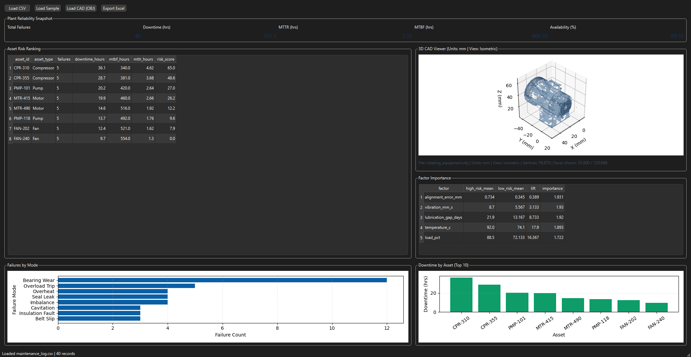

# Mechanical Reliability Dashboard

Desktop app for analyzing **rotating equipment reliability** (pumps, fans, compressors, motors) from maintenance CSV logs.



## What It Does
- Imports maintenance/failure CSV files.
- Cleans and standardizes columns automatically.
- Captures field inspection defects with photo evidence and structured severity/location tags.
- Auto-generates print-ready inspection reports (HTML + PDF) with picture captions and sign-off lines.
- Converts inspection defects directly into maintenance-log rows for analytics ingestion.
- Computes plant KPIs:
  - `MTBF`
  - `MTTR`
  - `Availability`
  - `Total downtime`
- Ranks assets by risk score.
- Shows failure-mode and downtime charts.
- Embeds a 3D CAD viewer (OBJ) with millimeter axes and isometric default view.
- Exports full analysis to Excel.

## Real-World Application: Rotating Equipment Reliability
This dashboard is designed for reliability work on pumps, fans, compressors, and motors in live plant settings.

It starts with the data engineers already have:
- inspection and maintenance logs
- vibration, temperature, and load readings
- downtime and repair history

Then it turns raw records into decisions:
- **Descriptive analytics:** where failures are happening most often by asset, line, shift, and component.
- **Diagnostic analytics:** which conditions are most associated with recurring failures (for example lubrication delay, overload, misalignment, elevated bearing temperature).
- **Actionable priorities:** which assets should be serviced first, and what intervention should be done next.

The practical payoff is straightforward: fewer surprise breakdowns, tighter maintenance planning, and lower production loss from downtime.

## Tech Stack
- Python
- PySide6 (desktop UI)
- pandas / numpy (data processing)
- matplotlib (charts)
- openpyxl (Excel export)
- PyInstaller (downloadable Windows app build)

## Project Structure
```text
mech_reliability_app/
  app/
    analytics.py
    io_utils.py
    main.py
    field_dialog.py
    field_pipeline.py
    ui.py
  assets/
    dashboard-preview.svg
    dashboard-preview-v2.svg
    dashboard-preview-v3.svg
    dashboard-preview-real-v1.png
  sample_data/
    maintenance_log.csv
  scripts/
    build_windows.ps1
  tests/
    test_analytics.py
  .github/workflows/windows-release.yml
  requirements.txt
  requirements-dev.txt
```

## Quick Start (Source Run)
```powershell
cd mech_reliability_app
python -m venv .venv
.venv\Scripts\Activate.ps1
pip install -r requirements.txt
python -m app.main
```

## CSV Schema
The app accepts flexible names (e.g. `equipment_id` maps to `asset_id`), but these are the canonical fields:

| Column | Type | Required | Example |
|---|---|---:|---|
| `event_date` | date/datetime | No | `2025-02-10` |
| `asset_id` | string | Yes | `CPR-310` |
| `asset_type` | string | No | `Compressor` |
| `failure_mode` | string | Yes | `Overheat` |
| `downtime_hours` | number | Yes | `8.3` |
| `repair_hours` | number | Yes | `5.1` |
| `operating_hours` | number | No | `320` |
| `vibration_mm_s` | number | No | `9.7` |
| `temperature_c` | number | No | `97` |
| `load_pct` | number | No | `94` |
| `lubrication_gap_days` | number | No | `25` |
| `alignment_error_mm` | number | No | `0.86` |

## Build Downloadable Windows App
```powershell
cd mech_reliability_app
python -m venv .venv
.venv\Scripts\Activate.ps1
pip install -r requirements-dev.txt
powershell -ExecutionPolicy Bypass -File scripts/build_windows.ps1
```

Output:
- `dist/ReliabilityDashboard/`

You can zip this folder and share it directly with users.

## Publish to GitHub Releases (Download Link for Others)
This repo includes a workflow: `.github/workflows/windows-release.yml`.

### Steps
1. Push this project to a GitHub repository.
2. Tag a version:
   ```powershell
   git tag v0.1.0
   git push origin v0.1.0
   ```
3. GitHub Actions will build the Windows app and attach `ReliabilityDashboard-windows.zip` to the Release.
4. Share that Release URL for laptop download.

## Sample Data
Use:
- `sample_data/maintenance_log.csv`

In the app, click **Load Sample** to test immediately.

## Tests
```powershell
cd mech_reliability_app
python -m pytest
```
